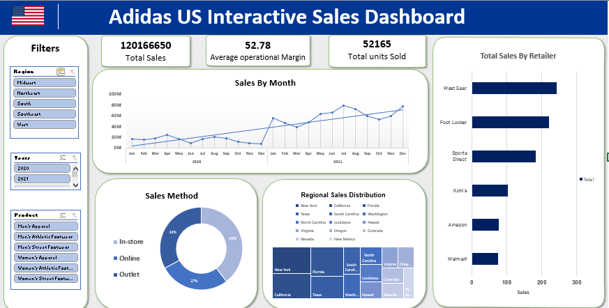
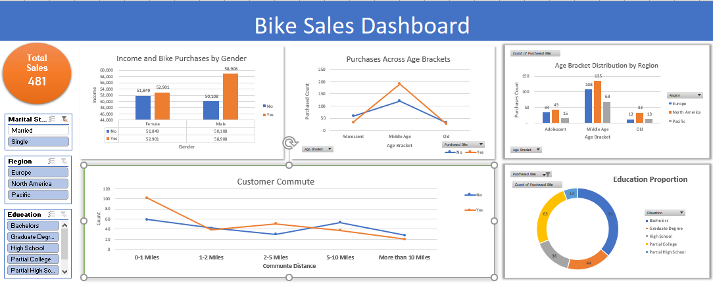
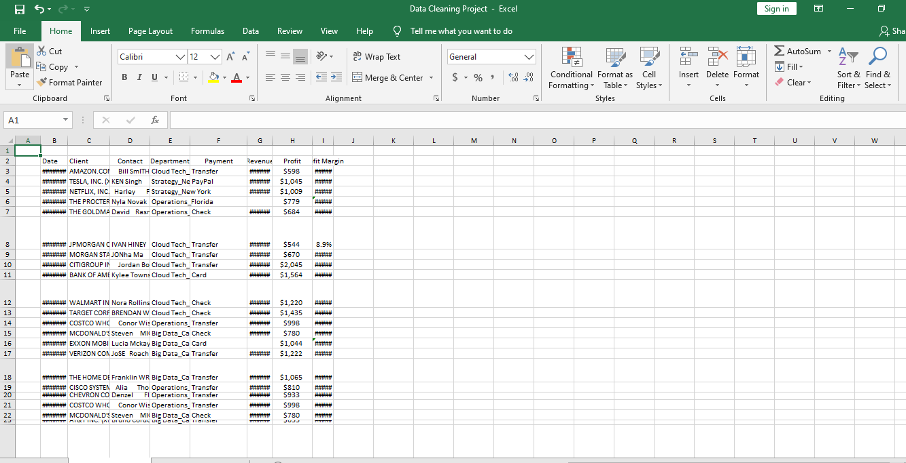
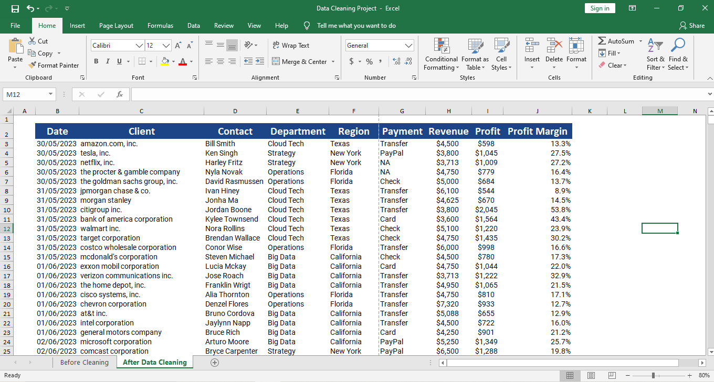

# 📊 Excel Dashboard Projects

This repository contains Excel-based dashboard projects showcasing data visualization, business intelligence, and data cleaning skills. Each project demonstrates the use of slicers, pivot tables, charts, and calculated metrics to extract insights from raw data.

---

## 🟦 Adidas US Sales Dashboard

**Overview:**  
An interactive dashboard built in Excel to analyze Adidas sales across regions, products, and sales methods.  
**Highlights:**
- Dynamic slicers for region, year, and product category
- Visual insights into sales by date, method, and retailer
- Map-based region performance summary

---

## 🚴 Bike Sales Analysis Dashboard

**Overview:**  
Excel dashboard examining customer demographics and their purchasing decisions regarding bikes.  
**Highlights:**
- Visual breakdown by age group, gender, commute distance, and education level
- Insights into buyer trends and purchasing likelihood

---

## 🧹 Data Cleaning (Before vs After)

**Before Cleaning:**

**After Cleaning:**

**Overview:**  
Performed data cleaning on a messy dataset to prepare it for accurate analysis.  
**Techniques Used:**
- Removed duplicates, fixed formatting issues, standardized values
- Ensured consistency and structure in tabular data for future use

---

### 📁 Tools Used
- Microsoft Excel
- Pivot Tables
- Slicers
- Conditional Formatting
- Charts (Pie, Bar, Line, Map)
